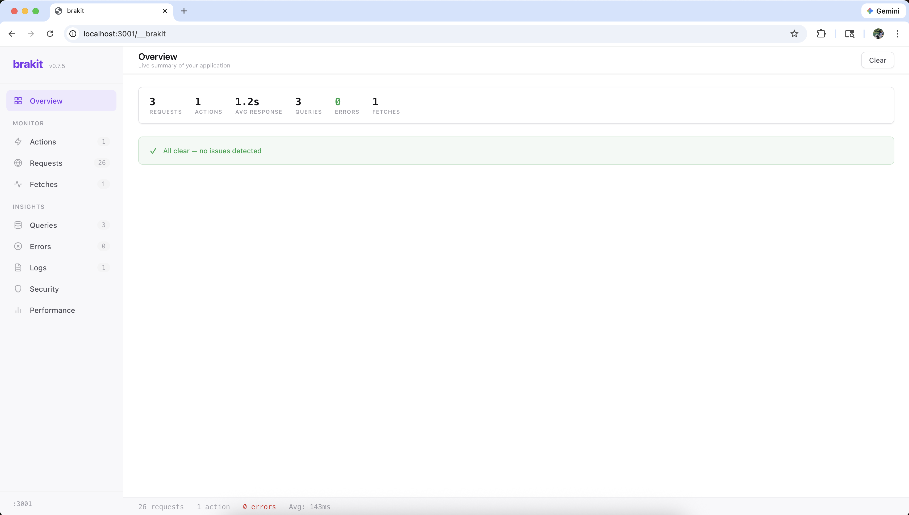

<h1 align="center">&nbsp;&nbsp;Brakit</h1>

<p align="center">
  <b>See what your app is actually doing.</b> <br />
  Every request, query, and security issue — before you ship. <br />
  <b>Open source · Local only · Zero config · 2 dependencies</b>
</p>

<h3 align="center">
  <a href="docs/design/architecture.md">Architecture</a> &bull;
  <a href="https://brakit.ai">Website</a> &bull;
  <a href="CONTRIBUTING.md">Contributing</a>
</h3>

<h4 align="center">
  <a href="LICENSE">
    
  </a>
  <a href="https://nodejs.org">
    = 18" />
  </a>
  <a href="https://typescriptlang.org">
    
  </a>
  <a href="CONTRIBUTING.md">
    
  </a>
</h4>

---

<p align="center">
  
</p>

## Quick Start

```bash
npx brakit install
```

That's it. Brakit detects your framework, adds itself as a devDependency, and creates the instrumentation file. Start your app normally:

```bash
npm run dev
```

Dashboard at `http://localhost:<port>/__brakit`. Insights in the terminal.

> **Requirements:** Node.js >= 18 and a project with `package.json`.

---

## What You Get

- **Live dashboard** at `/__brakit` — performance overview, request history, scatter charts, real-time via SSE
- **8 security rules** scanned against live traffic — leaked secrets, PII in responses, missing auth flags
- **Time breakdown** — every endpoint shows where time goes: DB, Fetch, or App code
- **N+1 query detection** — same query pattern repeated 5+ times in a single request
- **Regression detection** — p95 latency or query count increased vs. previous session
- **Action-level visibility** — see "Sign Up" and "Load Dashboard", not 47 raw HTTP requests
- **Duplicate detection** — same API called twice? Flagged with redundancy percentage
- **Full server tracing** — fetch calls, DB queries, console logs, errors — zero code changes
- **Response overfetch** — large JSON responses with many fields your client doesn't use
- **Performance tracking** — health grades and p95 trends across dev sessions

---

## You Don't Know What Your API Is Doing

You ship a signup flow. It works. But behind the scenes — 3 duplicate fetches, an N+1 query hitting the DB 12 times, and your user's email sitting in the response body unmasked. You'd never know without digging through network tabs and server logs for an hour.

Brakit watches every action your app takes — not raw HTTP noise, but what actually happened: "Sign Up" took 847ms, fired 4 queries (one is an N+1), called Clerk twice (one failed), and leaked a secret in the response. One glance. No `console.log`. No guessing.

---

## Security Scanner

8 high-confidence rules that scan your live traffic and flag real issues — not theoretical ones:

|              | Rule               | What it catches                                                                  |
| ------------ | ------------------ | -------------------------------------------------------------------------------- |
| **Critical** | Exposed Secret     | Response contains `password`, `api_key`, `client_secret` fields with real values |
| **Critical** | Token in URL       | Auth tokens in query parameters instead of headers                               |
| **Critical** | Stack Trace Leak   | Internal stack traces sent to the client                                         |
| **Critical** | Error Info Leak    | DB connection strings, SQL queries, or secret values in error responses          |
| Warning      | PII in Response    | API echoes back emails, returns full user records with internal IDs              |
| Warning      | Insecure Cookie    | Missing `HttpOnly` or `SameSite` flags                                           |
| Warning      | Sensitive Logs     | Passwords, secrets, or token values in console output                            |
| Warning      | CORS + Credentials | `credentials: true` with wildcard origin                                         |

---

## Who Is This For

Developers using AI tools (Cursor, Copilot, Claude Code) to generate API code they don't fully review. Developers who debug with `console.log` and wish they could just see every action their API is executing. Anyone building Node.js APIs who wants to catch security and performance issues before production.

---

## How It Works

```
import 'brakit'  →  hooks into http.Server  →  captures everything
                          |
                          +-- Dashboard UI    (/__brakit)
                          +-- Live SSE stream (real-time updates)
                          +-- Terminal output  (insights as you develop)
```

`import 'brakit'` runs inside your process. It patches `http.Server.prototype.emit` to intercept all requests — capturing request/response pairs, grouping them into actions, and streaming everything to the dashboard at `/__brakit` on your existing port. No proxy, no second process, no different port.

Instrumentation hooks capture fetch calls, DB queries, console output, and errors automatically — zero code changes.

### Production Safety

Brakit never runs in production. 7 independent layers ensure it:

| #   | Layer                        | How it blocks                             |
| --- | ---------------------------- | ----------------------------------------- |
| 1   | `shouldActivate()`           | Checks `NODE_ENV` + 15 cloud/CI env vars  |
| 2   | `instrumentation.ts` guard   | Its own `NODE_ENV !== 'production'` check |
| 3   | devDependency                | Pruned in production builds               |
| 4   | `try/catch` on import        | Missing module = silent no-op             |
| 5   | Localhost-only dashboard     | Non-local IPs get 404 on `/__brakit`      |
| 6   | `safeWrap` + circuit breaker | 10 errors = brakit self-disables          |
| 7   | `BRAKIT_DISABLE=true`        | Manual kill switch                        |

### Supported Frameworks

| Framework | Status                     |
| --------- | -------------------------- |
| Next.js   | Full support (auto-detect) |
| Remix     | Auto-detect                |
| Nuxt      | Auto-detect                |
| Vite      | Auto-detect                |
| Astro     | Auto-detect                |
| Express   | Auto-detect                |
| Fastify   | Auto-detect                |

### Supported Databases

| Driver  | Status    |
| ------- | --------- |
| pg      | Supported |
| mysql2  | Supported |
| Prisma  | Supported |
| SQLite  | Planned   |
| MongoDB | Planned   |
| Drizzle | Planned   |

---

## Uninstall

```bash
npx brakit uninstall
```

Removes the instrumentation file and devDependency. Your app is unchanged.

---

## Development

```bash
git clone https://github.com/brakit-ai/brakit.git
cd brakit

npm install
npm run build       # Build with tsup
npm run dev         # Watch mode
npm run typecheck   # Type-check without emitting
npm test            # Run tests with vitest
```

Only 2 production dependencies: `citty` (CLI) and `picocolors` (terminal colors). Everything else is Node.js built-ins.

### Architecture

```
src/
  runtime/        In-process entry point, interceptor, capture, safety
  analysis/       Insights engine and security scanner
    insights/     InsightRule implementations (one file per rule)
    rules/        SecurityRule implementations (one file per rule)
  cli/            CLI commands (install, uninstall)
  constants/      Shared thresholds, route paths, limits
  dashboard/
    api/          REST handlers — requests, flows, telemetry, metrics
    client/       Browser JS generated as template strings
      views/      Tab renderers (overview, flows, graph, etc.)
    styles/       CSS modules
  detect/         Framework auto-detection
  instrument/     Database adapters and instrumentation hooks
    adapters/     BrakitAdapter implementations (one file per library)
    hooks/        Core hooks (fetch, console, errors, context)
  output/         Terminal insight listener
  store/          In-memory telemetry stores + persistent metrics
  types/          TypeScript definitions by domain
  utils/          Shared utilities (collections, format, math, endpoint)
```

---

## Contributing

Brakit is early and moving fast. The most common contributions — adding a
database adapter, a security rule, or an insight rule — each require exactly
one file and one interface. See [CONTRIBUTING.md](CONTRIBUTING.md) for
step-by-step guides.

Some areas where help would be great:

- **Database adapters** — Drizzle, Mongoose, SQLite, MongoDB
- **Insight rules** — New performance patterns, custom thresholds
- **Security rules** — More patterns, configurable severity
- **Dashboard** — Request diff, timeline view, HAR export

Please open an issue first for larger changes so we can discuss the approach.

## License

[MIT](LICENSE)
